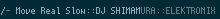

# XMMS2 Tools

A set of tools for working with [XMMS2](http://xmms2.org).

## dxmms2
*a dmenu shell for xmms2*

See the sub-directory

## xmms2-string.rb
*a track-progression indicator for use in [xmobar](http://projects.haskell.org/xmobar/)*

  

  The script can be placed in `.config/xmms2/startup.d` to have it run when 
  xmms2 starts up. You can configure xmobar with this line in `commands`: 

      , Run PipeReader "/tmp/YOUR_USER_NAME_HERE-xmms2-string-ipc-pipe" "xmms2_curr"

  replacing `YOUR_USER_NAME_HERE` with your login name.

  The far-left indicator is animated and highlighted when a track is playing. It 
  turns into an asterisk when play is paused or stopped, but also turns red when 
  stopped. The next indicator shows whether play repeats at the end of the track 
  (`T`), at the end of the playlist (`P`) or not at all (`-`). The highlight on 
  the track info (`title::artist::album`) indicates track progress. The string
  `XMMS2` is displayed when the xmms2 daemon can't be accessed or when there's
  some other error.

## xc
*a tool for manipulating xmms2 collections. requires `xce-serv` to be running*

## xce-serv
*a server that manages a stack machine and interfaces with an `xmms2d` for `xc` clients*

